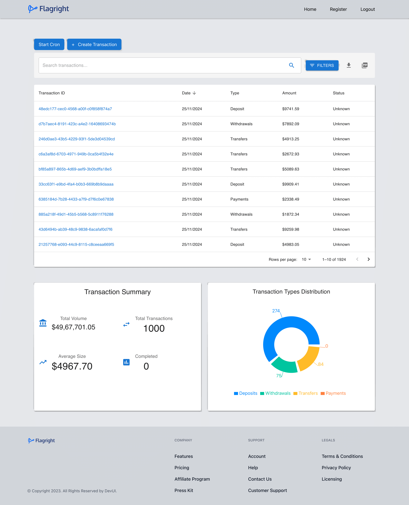

<p align='center'>
<b>A Project built as an Intern assignment for Flagright</b>
</p>

<p align='center'>

</p>


<p align='center'>
<b>Transaction Management CRUD API</b>
</p>

---

## 🚀 Link to [Frontend](https://github.com/Smr0303/flagRight-Assesment/tree/28b6ea1d41972a5fa7c1dede7212f3ea8cb1b300/frontend), [Backend](https://github.com/Smr0303/flagRight-Assesment/tree/28b6ea1d41972a5fa7c1dede7212f3ea8cb1b300/backend)


## 📷 Link to [Screenshots](./SCREENSHOTS.md)

## 🧾 Project Description

A comprehensive Transaction Management API that enables companies to manage, track, and analyze their transactions efficiently. The system supports role-based access control with different levels of permissions for administrators, CEOs, and employees and providing real time transaction analytics with summary reports and transaction generation

## 🧾 Key Assumptions

- While using the project first login using Admin test credentials provided below as no seperate Admin dashboard is made . So users can register themselves as Admin or at other role using that account
- The system is designed keeping in mind for a single company having employees with multiple roles (Admin, CEO, Employee, etc.)
- Only company administrators have access to user registration and CRON job management
- All other features are accessible to all authenticated users within the company
- Transaction data follows the Flagright Docs Transaction schema with an additional description field

## 🚀 Deployed Link Remember to login first using Admin credentials [Link](https://flag-right-assesment-w5np.vercel.app/)
## ✨ Features

### Core Features

- [x] Create and Read operations for transactions
- [x] Role-based access control
- [x] Automated transaction generation via CRON job
- [x] Search and filtering capabilities
- [x] Transaction reporting and analytics
- [x] Paginated responses for optimal performance
- [x] Dashboard for transaction management

### User Roles & Permissions

**Admin**
- Full system access
- User registration management
- CRON job control (start/stop)
- All transaction operations

**Other Roles (CEO, Employees)**
- View transactions
- Create transactions
- Search and filter transactions
- Generate reports
- Access dashboard

### Authentication Management
- [x] User with Admin rights can only register new employees
- [x] Role based access to register User and control CRON jobs 

### Transaction Management

- [x] Create new transactions with custom details
- [x] Retrieve transactions by ID
- [x] Search transactions by multiple criteria:
  - User ID (mandatory)
  - Date range (mandatory)
  - Description (mandatory)
  - Tags (mandatory)
  - Amount
  - Country
  
### Dashboard Features

- [x] Real-time Transaction monitoring
- [x] Advanced filtering system
- [x] Sorting capabilities:
  - Amount (mandatory)
  - Timestamp (mandatory)
- [x] CRON job control panel (admin only)
- [x] Transactions analytics 
- [x] Transaction Summary in Pdf format
- [x] CSV download of transaction summary
- [x] Pagination is implemented for better UX and reduce server load
      

**Here is a table depicting the user privileges for better clarity**

<table>
<thead>
  <tr>
    <th> </th>
    <th colspan="1">User Management</th>
    <th colspan="2">CRON Jobs</th>
    <th colspan="4">Transactions</th>
    <th colspan="2">Reports</th>
  </tr>
</thead>
<tbody>
  <tr>
    <td></td>
    <td><b><u>Register</u></b></td>
    <td><b><u>Start</u></b></td>
    <td><b><u>Stop</u></b></td>
    <td><b><u>Create</u></b></td>
    <td><b><u>View</u></b></td>
    <td><b><u>Search</u></b></td>
    <td><b><u>Filter</u></b></td>
    <td><b><u>CSV</u></b></td>
    <td><b><u>PDF</u></b></td>
  </tr>
  <tr>
    <td><b>Admin</b></td>
    <td>✔</td>
    <td>✔</td>
    <td>✔</td>
    <td>✔</td>
    <td>✔</td>
    <td>✔</td>
    <td>✔</td>
    <td>✔</td>
    <td>✔</td>
  </tr>
  <tr>
    <td><b>Employee</b></td>
    <td>-</td>
    <td>-</td>
    <td>-</td>
    <td>✔</td>
    <td>✔</td>
    <td>✔</td>
    <td>✔</td>
    <td>✔</td>
    <td>✔</td>
  </tr>
</tbody>
</table>

## ⚙ Tools and Technologies used

#### [Frontend](https://github.com/Smr0303/flagRight-Assesment/tree/28b6ea1d41972a5fa7c1dede7212f3ea8cb1b300/frontend)

1. [React.js](https://reactjs.org/)
2. [React-icons](https://mui.com/)

#### [Backend](https://github.com/Smr0303/flagRight-Assesment/tree/28b6ea1d41972a5fa7c1dede7212f3ea8cb1b300/backend)

1. [Node.js](https://nodejs.org/en/)
2. [Express.js](https://expressjs.com/)
3. [Supabase](https://supabase.com/)
4. [PdfKit](https://www.npmjs.com/package/pdfkit)

## 🛠 Installation and setup

1. Clone the repo to your local machine.
2. Open Terminal and direct into the frontend folder
   ```bash
   cd frontend
   ```
3. Install the required dependency for server using :

   ```javascript
   npm install
   ```

4. Create a `.env` file and copy-paste the contents of `.env.sample` in it.

5. Start the dev server using :

   ```javascript
   npm run dev
   ```

## 🏎 Creating production built

1. Create a production ready react app using the command :

   ```javascript
   npm run build
   ```
### 🚀 Running the Frontend Using Docker

Here’s how to build and run your frontend application using Docker:

---

### Step 1: Build the Docker Image

Use the following command to build the Docker image for your frontend:

```bash
docker build --build-arg VITE_API_URL=http://localhost:8000/api -t frontend-app   
```

Use the command to run the docker image
```bash
docker run -p 80:80 frontend-app
```   

## 🤝 Test user credentials

**Role**       | **E-mail**          | **Password** |
-------------  | ------------------- | ------------ |
Admin          | sam@gmail.com       | 12345678     |
Other employee | i@gmail.com         | 12345678     |

## 🛠 For Backend Installation and Setup

1. Come back to the root directory
   ```bash
      cd ..
   ```

2. The rest instructions are provided  [here](https://github.com/Smr0303/flagRight-Assesment/blob/ef67aff3e995bfdefdd06da9c9a3719ad06b2320/backend/SETUP_GUIDE.md)
